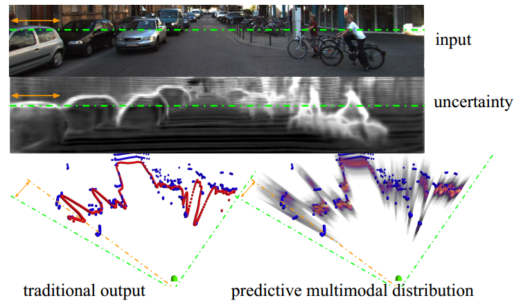

# Monodepth uncertainty

[project webpage](http://www.contrib.andrew.cmu.edu/~gengshay/iros19mono)



## Requirements
- python 3.6.7
- tensorflow 1.8.0

## Weights
- [trained on kitti+nyuv2](https://drive.google.com/file/d/1wSlShyZevyOxRxYBYkwkqaW82IlaVSoz/view?usp=sharing)

## Test
On KITTI (test set)
```
CUDA_VISIBLE_DEVICES=3 python test.py --check weights-kitti-nyu-resizespp-100-v2/model-320000 --con configs/model-1s100.config --input_image figs/kitti_2011_09_26_drive_0001_sync_02_0000000012.jpg --max_depth 100
```
On NYU (test set)
```
CUDA_VISIBLE_DEVICES=3 python test.py --check weights-kitti-nyu-resizespp-100-v2/model-320000 --con configs/model-1s100.config --input_image figs/nyu_1449.jpg --max_depth 10
```


KITTI expected depth


KITTI entropy


NYU expected depth


NYU entropy

## Training
If you are interested in training the binary depth estimator, see [the tf code for training](https://drive.google.com/file/d/1IeYvglf94pRM5lZvuOQeGF62XxrrIrbS/view?usp=sharing). Note the training code is modified from [Monodepth](https://github.com/mrharicot/monodepth) and is very messy. It is recommended to start from Monodepth and only modify the dataloader as well as the loss function.

## Citation
```
@InProceedings{yang2019inferring,
author = {Yang, Gengshan and Hu, Peiyun and Ramanan, Deva},
title = {Inferring distributions over depth from a single image},
booktitle = {2019 IEEE/RSJ International Conference on Intelligent Robots and Systems (IROS)},
year = {2019}
}
```
