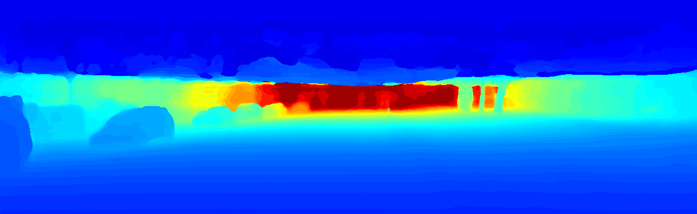
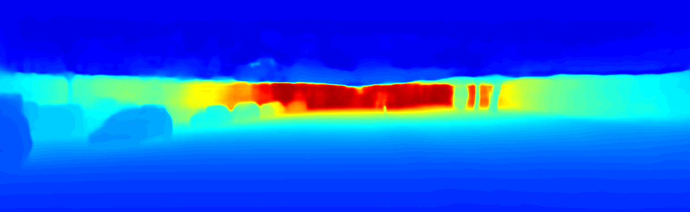
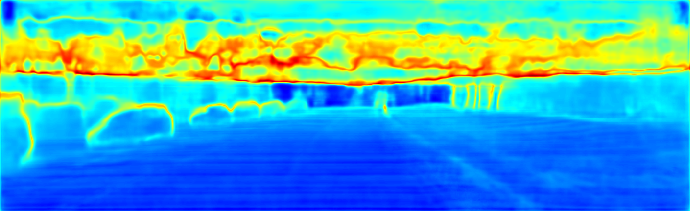
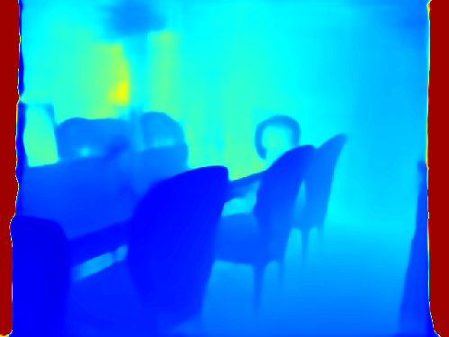
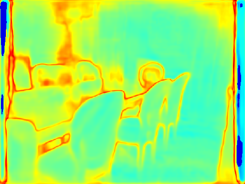
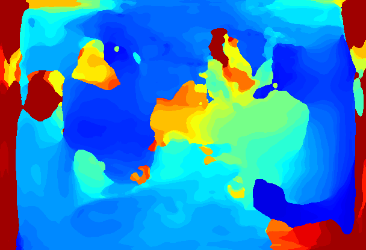
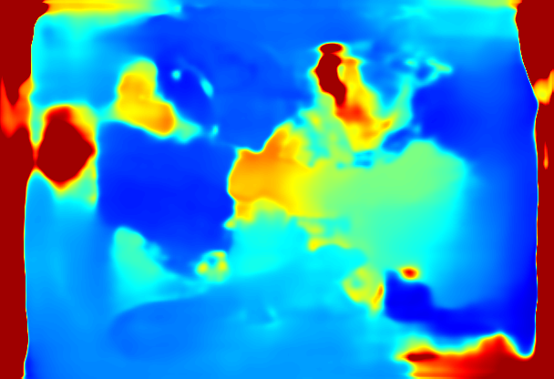
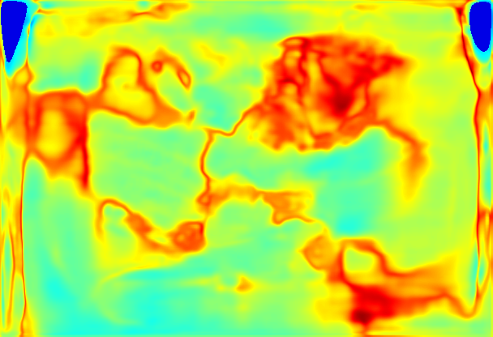

# monodepth uncertainty
## requirements
- python 3.6.7
- tensorflow 1.8.0


## test
On KITTI (test set)
```
CUDA_VISIBLE_DEVICES=3 python test.py --check weights-kitti-nyu-resizespp-100-v2/model-320000 --con configs/model-1s100.config --input_image figs/kitti_2011_09_26_drive_0001_sync_02_0000000012.jpg --max_depth 100
```
On NYU (test set)
```
CUDA_VISIBLE_DEVICES=3 python test.py --check weights-kitti-nyu-resizespp-100-v2/model-320000 --con configs/model-1s100.config --input_image figs/nyu_1449.jpg --max_depth 10
```
On Middlebury (not trained on it)
```
CUDA_VISIBLE_DEVICES=3 python test.py --check weights-kitti-nyu-resizespp-100-v2/model-320000 --con configs/model-1s100.config --input_image figs/middlebury_dimetrodon_10.png --max-depth 5
```












